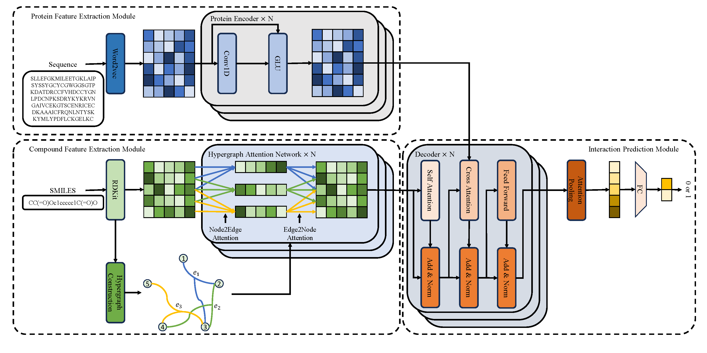

# HyperCPI: a novel method based on Hypergraph for Compound Protein Interaction prediction with good generalization ability

## Architecture



Official code for the paper "HyperCPI: a novel method based on Hypergraph for Compound Protein Interaction prediction with good generalization ability".

## Dependencies

- dgl = 1.1.1+cu117
- gensim = 4.3.0
- numpy = 1.22.3
- pandas = 1.5.3
- pyg = 2.3.0
- python = 3.10.0
- pytorch = 1.13.1
- rdkit = 2022.03.2

Install these dependencies with conda or pypi.

## Datasets

All datasets used in our work are provided in a directory called "data".

## Usage

1. Preprocess the raw data: extract the atom features and transform the amino acid sequences to embeddings

```bash
python mol_featurizer.py
```

2. Train and evaluate:  train and evaluate HyperCPI on benchmark datasets

```bash
python main.py
```

3. OOD experiments: train and evaluate HyperCPi on an OOD setting

```bash
python main_OOD.py
```

4. Run in a way that consumes less memory: run in this way if you can't run code for the kinase dataset because of insufficient memory

```bash
python mol_featurizer_kinase.py
python main_kinase.py					# For iid settings
python main_OOD_kinase.py				# For ood settings
```

